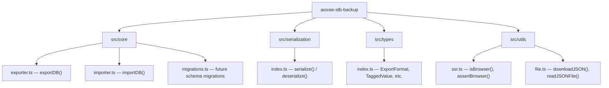

<!-- Don't delete it -->
<div name="readme-top"></div>

<!-- Organization Logo -->
<div align="center" style="display: flex; align-items: center; justify-content: center; gap: 16px;">
  
  <!-- TODO: Replace with project logo once available -->
  
</div>

&nbsp;

<!-- Badges -->
<div align="center">

[](https://www.npmjs.com/package/aossie-idb-backup)
[](LICENSE)
[](https://scorecard.dev/viewer/?uri=github.com/AOSSIE-Org/IndexedDB-Import-Export)

</div>

<!-- Organization/Project Social Handles -->
<p align="center">
<a href="https://t.me/StabilityNexus">
</a>
&nbsp;&nbsp;
<a href="https://x.com/aossie_org">
</a>
&nbsp;&nbsp;
<a href="https://discord.gg/hjUhu33uAn">
</a>
&nbsp;&nbsp;
<a href="https://www.linkedin.com/company/aossie/">
  </a>
&nbsp;&nbsp;
<a href="https://www.youtube.com/@AOSSIE-Org">
  </a>
</p>

---

<div align="center">
<h1>aossie-idb-backup</h1>
<p>A framework-agnostic, lightweight TypeScript library for exporting and importing IndexedDB databases via type-tagged JSON.</p>
</div>

---

## What is this?

`aossie-idb-backup` provides a simple, portable way to **back up and restore IndexedDB databases** in the browser. It produces a self-describing JSON file that preserves data types that `JSON.stringify` normally corrupts — such as `Uint8Array`, `bigint`, and `Date`.

The library is designed to be **framework-agnostic**: it works in any browser environment and includes SSR safety guards for server-rendered frameworks like Next.js and Nuxt.

---

## Features

- **Generic JSON export format** : Structured `schema` + `stores` mapping for portable, human-readable backups
- **Type-tagged serialization** : Lossless round-trip for `Uint8Array`, `bigint`, and `Date` using a `__type` tag convention
- **Import strategies** : Choose between `"overwrite"` (fresh restore) or `"merge"` (additive sync with existing data)
- **SSR-safe** : Graceful no-op guards for server-side rendering environments
- **Dual output** : Ships both ESM and CJS bundles
- **Lightweight** : Uses the [`idb`](https://github.com/jakearchibald/idb) wrapper over the native IndexedDB API with no heavy dependencies

---

## Tech Stack

| Category | Tools |
| --- | --- |
| Language | TypeScript 5 |
| IndexedDB | Native API + [`idb`](https://github.com/jakearchibald/idb) wrapper |
| Bundler | [`tsup`](https://tsup.egoist.dev/) (ESM + CJS) |
| Testing | [`vitest`](https://vitest.dev/) + [`happy-dom`](https://github.com/nicedayfor/happy-dom) |
| Linting | ESLint 9 + TypeScript ESLint |
| Formatting | Prettier |

---

## Architecture



---

## Export Format

The library produces a self-describing JSON structure:

```json
{
  "backupVersion": 1,
  "databaseName": "my-app-db",
  "databaseVersion": 3,
  "exportedAt": "2025-06-01T12:00:00.000Z",
  "schema": {
    "messages": {
      "keyPath": "id",
      "autoIncrement": false,
      "indexes": [
        { "name": "by-timestamp", "keyPath": "timestamp", "unique": false }
      ]
    }
  },
  "stores": {
    "messages": [
      {
        "id": "msg-001",
        "payload": { "__type": "u8", "value": "SGVsbG8gV29ybGQ=" },
        "timestamp": { "__type": "date", "value": "2025-06-01T12:00:00.000Z" },
        "fee": { "__type": "bigint", "value": "1000000000000000000" }
      }
    ]
  }
}
```

### Tagged Types

| Source Type | `__type` | Serialized `value` |
| --- | --- | --- |
| `Uint8Array` | `"u8"` | Base64-encoded string |
| `bigint` | `"bigint"` | String representation |
| `Date` | `"date"` | ISO 8601 string |

All other JSON-safe values (strings, numbers, booleans, nulls, plain objects, arrays) pass through unchanged.

---

## Getting Started

### Prerequisites

- [Node.js](https://nodejs.org/) >= 20
- npm (ships with Node.js)

### Installation

1. **Clone the repository**

```bash
git clone https://github.com/AOSSIE-Org/IndexedDB-Import-Export.git
cd IndexedDB-Import-Export
```

2. **Install dependencies**

```bash
npm install
```

3. **Build the library**

```bash
npm run build
```

4. **Run tests**

```bash
npm test
```

### Available Scripts

| Script | Description |
| --- | --- |
| `npm run build` | Bundle the library with tsup (ESM + CJS + type declarations) |
| `npm test` | Run the test suite with Vitest |
| `npm run test:watch` | Run tests in watch mode during development |
| `npm run lint` | Lint source and test files with ESLint |
| `npm run format` | Auto-format code with Prettier |
| `npm run format:check` | Check formatting without modifying files |

---

## Usage

> **Note:** The core API is under active development. The examples below show the intended usage once the feature PRs are merged.

### Export a Database

```typescript
import { exportDB } from 'aossie-idb-backup';

const backup = await exportDB({
  dbName: 'my-app-db',
  // Optional: export only specific stores
  storeNames: ['messages', 'contacts'],
});

console.log(JSON.stringify(backup, null, 2));
```

### Import a Database

```typescript
import { importDB } from 'aossie-idb-backup';

// Overwrite: delete existing data and restore from backup
await importDB({
  dbName: 'my-app-db',
  backupData: backup,
  strategy: 'overwrite',
});

// Merge: keep existing data and add/update from backup
await importDB({
  dbName: 'my-app-db',
  backupData: backup,
  strategy: 'merge',
});
```

### Download as JSON File

```typescript
import { downloadJSON } from 'aossie-idb-backup';

downloadJSON(backup, 'my-backup.json');
```

### Read a JSON Backup File

```typescript
import { readJSONFile } from 'aossie-idb-backup';

const fileInput = document.querySelector<HTMLInputElement>('#file-input');
const file = fileInput!.files![0];
const backup = await readJSONFile(file);
```

---

## Repository Links

- [Main Repository](https://github.com/AOSSIE-Org/IndexedDB-Import-Export)
- [Issue Tracker](https://github.com/AOSSIE-Org/IndexedDB-Import-Export/issues)

---

## Contributing

Contributions are welcome! If you would like to contribute, please refer to [CONTRIBUTING.md](./CONTRIBUTING.md).

---

## Maintainers

- [Atharva0506](https://github.com/Atharva0506)
- [rohans02](https://github.com/rohans02)

---

## License

This project is licensed under the **GNU General Public License v3.0**.
See the [LICENSE](LICENSE) file for details.

---

## Contributors

Thanks to everyone who has contributed to this project.

[](https://github.com/AOSSIE-Org/IndexedDB-Import-Export/graphs/contributors)

&copy; 2025 AOSSIE
